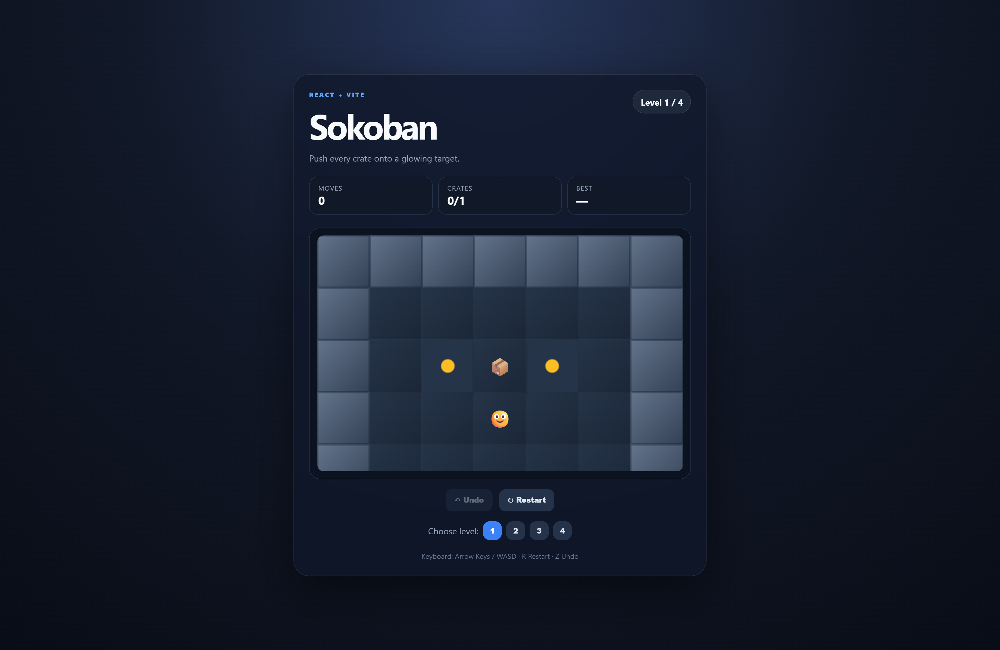

# 🎮 Sokoban Game

<p align="center">
  A modern and interactive <strong>Sokoban puzzle game</strong> built with React and Vite.
</p>

<p align="center">


</p>

---

## 📖 About The Project

**Sokoban** is a classic puzzle game where the player must push boxes onto designated target locations.

The challenge is to plan every move carefully because boxes can only be **pushed** and cannot be pulled.

This project is built using **ReactJS** and **Vite** with a responsive and modern user interface.

---

## 📸 Screenshot




---

## ✨ Features

- 🎮 Classic Sokoban gameplay
- 📦 Push boxes onto target locations
- 🗺️ Multiple playable levels
- ⌨️ Keyboard controls
- 🎯 Arrow Key controls
- 🕹️ WASD controls
- 📱 Mobile-friendly on-screen controls
- ↩️ Undo previous moves
- 🔄 Restart the current level
- 📊 Move counter
- 🏆 Level completion detection
- 🎉 Victory modal
- 📱 Fully responsive design
- 🎨 Modern and polished UI

---

## 🛠️ Technologies Used

| Technology | Purpose |
|---|---|
| ⚛️ ReactJS | Building the user interface |
| ⚡ Vite | Fast development and build tool |
| 🟨 JavaScript | Game logic and functionality |
| 🎨 CSS3 | Styling and responsive design |
| 🌐 HTML5 | Application structure |

---

## 🎮 Game Controls

| Key | Action |
|---|---|
| ⬆️ Arrow Up / `W` | Move Up |
| ⬇️ Arrow Down / `S` | Move Down |
| ⬅️ Arrow Left / `A` | Move Left |
| ➡️ Arrow Right / `D` | Move Right |
| 🔄 `R` | Restart Level |
| ↩️ `Z` | Undo Move |

---

## 📂 Project Structure

```text
sokoban-react-vite/
│
├── public/
│
├── src/
│   ├── App.jsx
│   ├── levels.js
│   ├── main.jsx
│   └── styles.css
│
├── index.html
├── package.json
├── README.md
└── vite.config.js
```

---

## 🚀 Getting Started

### 1️⃣ Clone the Repository

```bash
git clone https://github.com/ajinkya029/sokoban.git
```

### 2️⃣ Navigate to the Project

```bash
cd sokoban-react-vite
```

### 3️⃣ Install Dependencies

```bash
npm install
```

### 4️⃣ Start the Development Server

```bash
npm run dev
```

The application will run on a local development server.

---

## 📦 Build for Production

To create a production build:

```bash
npm run build
```

To preview the production build:

```bash
npm run preview
```

---

## 🧩 How to Play

1. Move the player around the game board.
2. Push the boxes toward the target locations.
3. You cannot pull boxes backward.
4. Plan your moves carefully to avoid getting boxes stuck.
5. Complete the level by placing all boxes on their targets. 🏆

---

## 🎯 Learning Outcomes

This project demonstrates:

- React state management
- Component-based architecture
- Keyboard event handling
- Game logic implementation
- Array and grid manipulation
- Conditional rendering
- Responsive UI design
- User interaction handling
- Building interactive web applications

---

## 🔮 Future Improvements

- 💾 Save best scores using LocalStorage
- 🔊 Add sound effects
- 🎵 Add background music
- 📈 Add leaderboard functionality
- 🗺️ Add more challenging levels
- ⏱️ Add a timer
- 🌙 Add Dark/Light mode
- 🎨 Add animations
- 📱 Improve mobile gameplay experience

---

## 👨‍💻 Author

**Ajinkya Dhatrak**

Github : ```https://github.com/ajinkya029```

Full-Stack MERN Developer

⭐ If you like this project, consider giving it a star!
